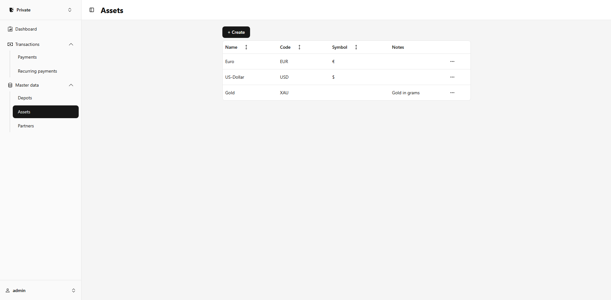
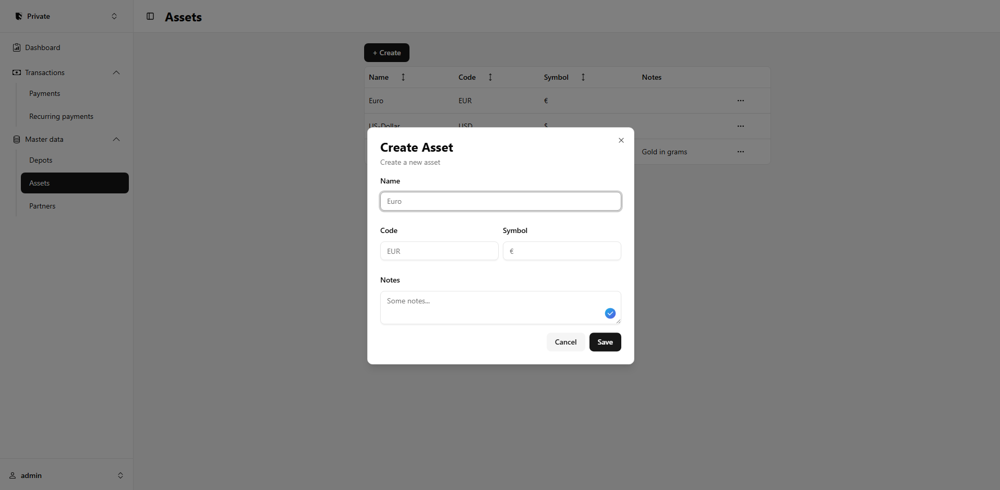
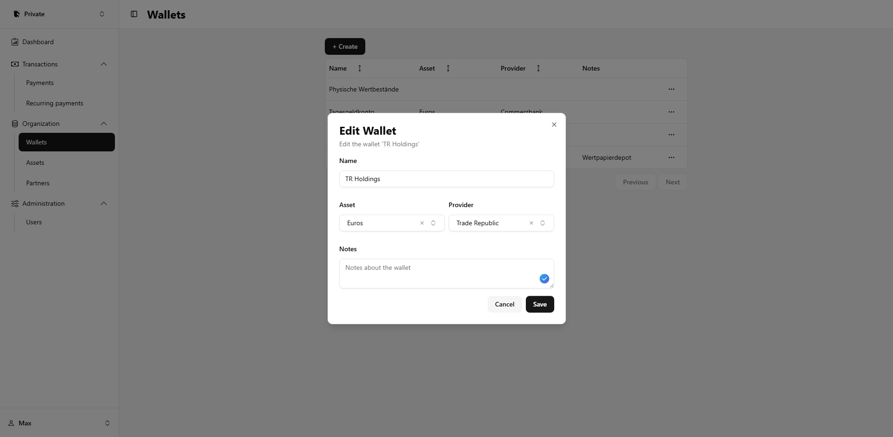
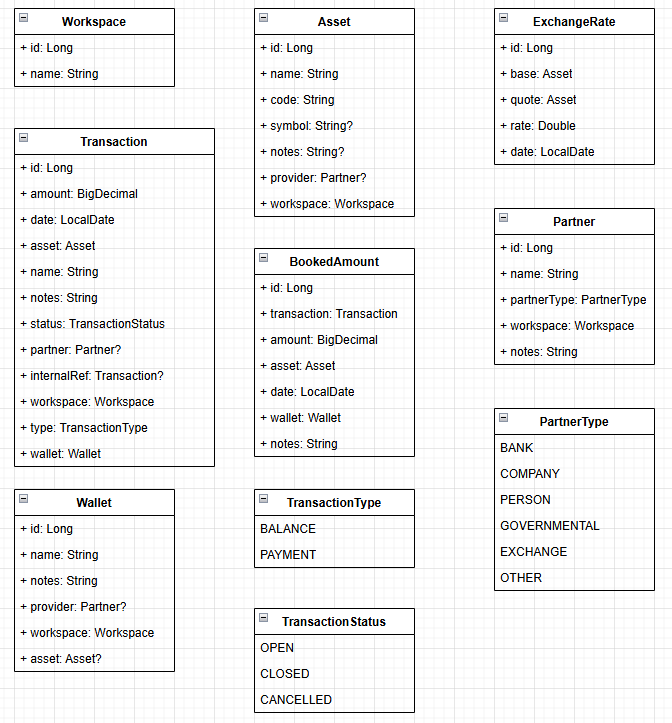

# finance-hub

> [!CAUTION]
> This project is still work-in-progress.
> There's nothing to see here yet.
> 
> Please note that a lot of the code here is going to be a bit messy since the project
> is still in very early development. I'll get around to refactoring some stuff later.

This is my personal finance app used for tracking my income and expenses.

- Track expected payments
- Confirm payments when they actually happen
- Track all your assets, not just cash
- Create different workspaces to separate and share payments

### Preview

> [!WARNING]
> Most things shown here are still work-in-progress and subject to changes

| Assets                       | Create a new asset                       |
|------------------------------|------------------------------------------|
|  |  |

| Wallets                        | Edit a wallet                          |
|--------------------------------|----------------------------------------|
|  |  |

### Data model

- Workspaces are used to separate and share all resources such as assets, transactions, exchange rates and wallets
- Assets cam be anything, currencies, stocks, bonds, etc.
- A wallet is a unit that holds actual assets, like a bank account, trading wallet, etc.
- A Transaction is an expected payment or a balance adjustment
- A BookedAmount is an actual payment that has been made
- Exchange rates between assets can be used to convert all amounts to a common currency for a better overview
- Partners can be optionally added to payments to keep track of where payments are going or coming from

With this we can model pretty much anything, we can easily track, cash, commodities like gold, securities such as stocks, bonds and more.
We can also easily track payments and their status along with other information like how much was actually paid and when.
This way a Transaction can also be used to model simple credits that are yet to be repaid.

Anything else can be built on top of this. For recurring payments, for example, we just run a cron job that creates new transactions for upcoming payments.

### Building
In order to build a docker image of the application run the following command (on windows):
```shell
./gradlew.bat build "-Dquarkus.native.container-build=true" "-Dquarkus.container-image.builder=docker" "-Dquarkus.native.enabled=true" "-Dquarkus.package.jar.enabled=false" "-Dquarkus.container-image.build=true"
```
